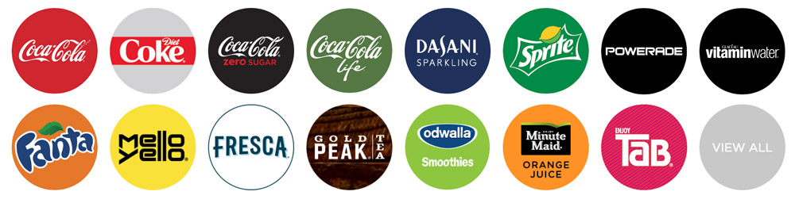

## Marketing Insights 
by Firuz Juraev (Ph.D candidate)

## Part 1: Course 1 
### Customer Segmentation 

#### Segmentation 
- Dividing the market into groups of potential customers (market segments), with distinct characteristics, behaviors, or needs. 
- Each segment should clearly differ from the other 
- People in each group should show a great deal of homogeneity in their behavior 
- 
#### Examples: 
 

#### Coca Cola 
- Coca Cola company created multiple brands for different market segments. If company sells only coca cola, in future they may loose many market segments to opponent companies. 
 

[200+ Coca Cola Brands](https://www.coca-colacompany.com/brands)

#### Benefits of Segmentation 

##### Benefits to the Oranization 
- Higher customer satisfaction 
- Better product design 
- Indentification of unfulfilled needs 

##### Benefits to the Customer 
- Personalizaed products and experiences 
- Convenience and time saving 
- Tailored products and services 

#### Who is your customer? 
Not knowing the asnwer will result in: 
- Waste of marketing resources 
- Failure in responding to market needs 
- You can not be everything to everyone 

#### Example: [Iridium Failure](http://content.time.com/time/specials/packages/article/0,28804,1898610_1898625_1898640,00.html) 
- Filed for bankruptcy in 1999, after the company had spent $5 billion. They produced a satellite phone that worked all over the world. The handsets were clunky, weighed about 1 lb. The handset cost $3,000 and talk time was as much as $5 per minute. 

#### Characteristics of useful segmentation 
- **Identifiable** - That is, we have to kind of understand and be able to identify who is who and who is in our segment. 
- **Substantial** - the segment should be large enough to be cost effective and be profitable (ex: small rural towns are not substantial for Walmart but large enough for Dollar stores). 
- **Accessibile** - So we need to have segments that we can access them because then we need to kind of distribute our products later to those segments and also use communication channels to to make them aware of the product and use our advertising strategies stable should be the other characteristic, meaning that each segment 
- **Stable** - Segments should be stable over long enough period of time (for creating long term marketing strategies)
- **Differntiable** - Segments should be respond differently to marketing programs (segmenting customers by gender for pen selling is not good diffentiable becuase there is not big difference in usage of pen between women and men). 
- **Actionable** - We want to have a segment that you can make an action on, meaning that we want to develop our marketing strategies and and products around that.

#### Major Segmentation Variables for Customer Markets 
- **Geographic** - Country, region, city, urban/rural, different climates
- **Demographics** - Age, income, gender, generation, martial status, ethnicity, occupation, education 
- **Psychographics** - Lifestyle, personality, activities, interests, values 
- **Behavioral** - Usage rate, loyalty, product knowledge, involvement, purchase occasion, buying stage
- **Benefits Sought** - Convenience, values, safety 

Examples: 
- **Geographic**: McDonalds in India does not serve meats becuase it's country that in their culture (e.g., vegetarian burgers). 
- **Demographics**:Rasor companies, they have reasons for men and women.  
- **Psychographics**: Intangible customer characteristics (expensive and time consuming) 
- **Behavioral**: like tobacco users, for example, in the tobacco industry, they use that like heavy smokers. They consume most of of the cigarettes and they try to segment their market and product advertising 
- **Benefits Sought**:  Laptop, we can have different benefits that we are looking after. So the benefits of these products are different. 

#### Important Points 
Which variable to use depends on 
- Type of industry 
- Type of product and market 
- Availability of information 
- Cost of sgmentation 
* Usually a combination of these variables are used 
* Remember the goal of segmentation! 
* To conduct a proper segmentation you need data and research! 

--- 

### Targeting 
- Next logical step after segmentation 
- Evaluating each segments **attractiveness** 
- Selecting one or more to enter 
- The goal is to select the segment with highest profit potential 

#### Segment Size 
- The number of customers in the segment **
- Total Spending Potential (SPI) **

#### Potential Growth 

#### Ability and Cost of Reach 
- How difficult and costly is to reach the people in that segment? 

#### Competition and Customer Satisfaction 
- How intense is the current competition (Supply) 
- If it is an attractive segment, it might have already been targeted by competition 
- Customer satisfaction with current offereings (**Low satisfaction is opportunity**) 
- Niche marketing is a good strategy in hyper competitive markets 

#### Barriers to Entry 
- Heavy investment? 
- Easy to enter? 

#### Mass Markets & Niche Markets 

##### Mass Markets 
- Large Market 
- General products (focus is on product rather than customer) 
- Communicating with the largest possible group of audience 
- TV commercial or a massive flyer printing campaign 
- Heavy Cost 

##### Niche Markets 
- Smaller markets 
- Requires far less money 
- More focused and targeted 
- Focus is on the customers and their specific needs 
- E.g., pen for left handed people (mass marketing, pen for everyone)

#### Segmentation Needs DATA 
_**Primary Data (Research)**_
- Descriptive Analysis (Observation, expert interviews, focus groups, etc) 
- Surveys 
- Cluster Analysis 
- Conjoint Analysis 
- etc 

_**Secondary Data (Research)**_
- Professonal databases that are available: Census, GFK MRI, Esri Business Analyst Online, etc. 

**EXAMPLE**: 
- Data: Books Selling 
- Base: Total Adults 
- Details: Bought last 12 months 

| Target | Total Sample | Weighted | Vertical  | Horizontal | Index     | 
| ------ | ------------ | -------- | --------- | ---------- | --------- |  
| Total  | 247,024 K    | 110,322 K| 100.00%   | 44.66%     | 100       | 
| Male   | 119,259 K    | 43,406  K| 39.35%    | 36.40%     | 81      ⬇️| 
| Female | 127,765 K    | 66,916  K| 60.65%    | 52.37%     | **117** ⬆️|

- Vertical (male) = Weighted(male) / Weighted(total) * 100 = 43,406K / 110,322K * 100 = **39.35** 
- Horizontal (male) = Weighted(male) / TotalSample(male) * 100 = 43,406K / 119,259K = **36.40**
- Index (male) = Horizontal(male) / Horizontal(total) * 100 = **81** 

## Part 2: Course 2 
* Instructor: Dana Mando 

### How to create a customer journey map (CJM) - 13 steps 
1. Define a clear opjective for the map 

You need to be very clear on what your overall goal for the map is. Is it to identify problematic areas in your customer experience? You know that something wrong is happening and you want to pinpoint exactly where that is. Maybe you're noticing a significant decline in profits and you want to get to the bottom of it to be able to fix it and address it. Or perhaps your goal for this map is to identify a new customer group that you suspect can be a huge opportunity for your business.

2. Gather the research 

A key step in putting your map together is the research. Your research will give you the information you need to put your map together. **Don't base your map on assumptions.** 
- Do quantative and qualitative data collection methods. 

3. 
