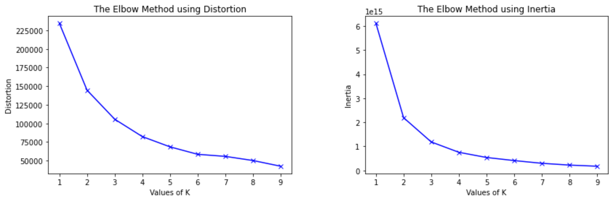
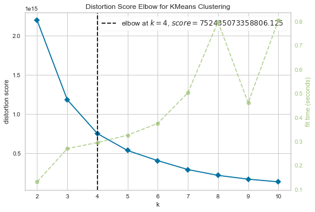
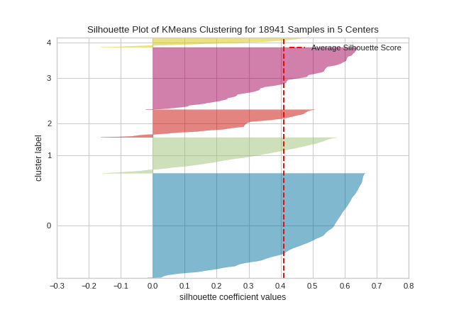

## Customer Segmentation Research 
by Firuz Juraev 

#### Figure 1: Framework of the paper


#### Related papers: 

### Checking for outliers 
1. Turkey outlier detector 

  

```python
def turkey_outlier_detector(df, cols=None):
    if cols  is None:
        cols = [str(s) for s in df.describe().columns]
        
    q1 = {}
    q3 = {}
    iqd = {}
    r_limit = {}
    l_limit = {}
    outlier_count = {}
    outlier_indices = {}
    for col in cols:
        q1[col] = np.percentile(df[col].values, 25)
        q3[col] = np.percentile(df[col].values, 75)
        iqd[col] = q3[col] - q1[col]
        r_limit[col] = q3[col] + 1.5*iqd[col]
        l_limit[col] = q1[col] - 1.5*iqd[col]
        data_outlier = df[~((df[col]<r_limit[col]).multiply(df[col]>l_limit[col]))]
        outlier_count[col] = data_outlier.shape[0]
        outlier_indices[col] = data_outlier.index
        
    for col in cols:
        print('_'*25)
        print(col+'-'*8+'>'+str(outlier_count[col]))
        
    return outlier_indices 
``` 

#### Detecting outliers with plot 

```python 
fig = plt.figure(figsize=(16,12))
sns.distplot(df['column']);
plt.show()

### with log 

df['column'] = np.log(df['column'])
fig = plt.figure(figsize=(16,12))
sns.distplot(df['column']);
plt.show()
```

### Features Correlations 

It shows the correlation between features. 
```python 
fig,ax = plt.subplots(figsize=(8,4)) ## play with size 
fig.suptitle("Title here", fontsize=30)
corrcoef = df.corr()
mask = np.array(corrcoef)
mask[np.tril_indices_from(mask)] = False
sns.heatmap(corrcoef, mask=mask, vmax=.8, annot=True, ax=ax)
plt.show();
``` 
   

#### Dependant variables detection 

```python 
def dependant_variable_detector(df):
    from sklearn.preprocessing import StandardScaler
    from sklearn.linear_model import LinearRegression
    scaler = StandardScaler()
    lr = LinearRegression()
    columns = list(df.columns)
    for col in columns:
        y = scaler.fit_transform(df[col].values.reshape(-1,1))
        X = scaler.fit_transform(df.drop(col, axis=1).values)
        lr.fit(X,y)
        print('Using '+col+' as dependent variable R2 score is :'+str(lr.score(X,y)))  
``` 
dependant_variable_detector(clientsDF) 

```
Using Recency as dependent variable R2 score is :0.14698126654287424
Using Frequency as dependent variable R2 score is :0.8656755788525865
Using Monetary as dependent variable R2 score is :0.862874153878725
Using Language as dependent variable R2 score is :0.007583512995698594
```

##### Output 

### Plotting data with PCA 

Principal component analysis (PCA) is a technique for reducing the dimensionality of such datasets, increasing interpretability but at the same time minimizing information loss. 

##### Code 
```python 
from sklearn.decomposition import PCA 
import matplotlib.pyplot as plt

def pca_2d_plot(pca, df):
    fig, ax = plt.subplots(figsize=(10,10))
    transformed_data = pca.transform(df.values)
    ax.scatter(transformed_data[:,0], transformed_data[:,1], s=3)
    plt.show()
 
pca = PCA(n_components=3) ## 3 number of features 
pca.fit(df.values) 
pca_2d_plot(pca, df) 
```

#### 3D PCA 

```python 
pca = PCA(n_components=3) 
pca.fit(df) 
PCA_ds = pd.DataFrame(pca.transform(df), columns=(["col1","col2", "col3"])) 

#A 3D Projection Of Data In The Reduced Dimension
x =PCA_ds["col1"]
y =PCA_ds["col2"]
z =PCA_ds["col3"]
#To plot
fig = plt.figure(figsize=(10,8))
ax = fig.add_subplot(111, projection="3d")
ax.scatter(x,y,z, c="maroon", marker="o" )
ax.set_title("A 3D Projection Of Data In The Reduced Dimension")
plt.show()
```

### Hopkins Statistic

```python 
def hopkins_statistic(df):
    from sklearn.neighbors import NearestNeighbors
    from sklearn.preprocessing import StandardScaler
    n_samples = df.shape[0]
    num_samples = [int(f*n_samples) for f in [0.25,0.5,0.75]]
    states = [123,42,67,248,654]
    for n in num_samples:
        print('-'*12+str(n)+'-'*12)
        hopkins_statistic = []
        for random_state in states:
            data = df.sample(n=n, random_state=random_state)
            nbrs = NearestNeighbors(n_neighbors=2)
            scaler = StandardScaler()
            X = scaler.fit_transform(data.values)
            nbrs.fit(X)
            sample_dist = nbrs.kneighbors(X)[0][:,1]
            sample_dist = np.sum(sample_dist)
            random_data = np.random.rand(X.shape[0], X.shape[1])
            nbrs.fit(random_data)
            random_dist = nbrs.kneighbors(random_data)[0][:,1]
            random_dist = np.sum(random_dist)
            hs = sample_dist/(sample_dist+random_dist)
            hopkins_statistic.append(hs)
            print('*'*25)
            print('hopkins statistic :'+str(hs))
        print('mean hopkins statistic :'+str(np.mean(np.array(hopkins_statistic))))
        print('hopkins statistic standard deviation :'+str(np.std(np.array(hopkins_statistic))))
```

   

* H=0.5 -> distances are similar 
* H=0.0 -> actual data are highly clustered 
* H=1.0 -> actual data are regularly distributed in the data space (e.g grid)   


### Selecting best number of clusters: k 

1. Elbow method 

```python 
from scipy.spatial.distance import cdist 
from sklearn.cluster import KMeans 

distortions = []
inertias = []
mapping1 = {}
mapping2 = {}
K = range(1, 10)
 
for k in K:
    # Building and fitting the model
    kmeanModel = KMeans(n_clusters=k).fit(X)
    kmeanModel.fit(X)
 
    distortions.append(sum(np.min(cdist(X, kmeanModel.cluster_centers_,
                                        'euclidean'), axis=1)) / X.shape[0])
    inertias.append(kmeanModel.inertia_)
 
    mapping1[k] = sum(np.min(cdist(X, kmeanModel.cluster_centers_,
                                   'euclidean'), axis=1)) / X.shape[0]
    mapping2[k] = kmeanModel.inertia_
    
### with distortions 
plt.plot(K, distortions, 'bx-')
plt.xlabel('Values of K')
plt.ylabel('Distortion')
plt.title('The Elbow Method using Distortion')
plt.show()

### Using the different values of Inertia
plt.plot(K, inertias, 'bx-')
plt.xlabel('Values of K')
plt.ylabel('Inertia')
plt.title('The Elbow Method using Inertia')
plt.show()

```
   

Link: https://www.geeksforgeeks.org/elbow-method-for-optimal-value-of-k-in-kmeans/ 

#### Elbow with Yellowbrick 

```python 
from yellowbrick.cluster import KElbowVisualizer 

print('Elbow Method to determine the number of clusters to be formed:')
Elbow_M = KElbowVisualizer(KMeans(), k=10)
Elbow_M.fit(df)
Elbow_M.show() 
```




## Clustering Techniques 
1. Fuzzy C-Means Clustering 
```
pip install fuzzy-c-means
```
[Installation](https://pypi.org/project/fuzzy-c-means/)

```python 
import numpy as np
from fcmeans import FCM
from matplotlib import pyplot as plt

## fitting the fuzzy-c-means 

fcm = FCM(n_clusters=2)
fcm.fit(X)

# outputs
fcm_centers = fcm.centers
fcm_labels = fcm.predict(X)

# plot result = showing results 
f, axes = plt.subplots(1, 2, figsize=(11,5))
axes[0].scatter(X[:,0], X[:,1], alpha=.1)
axes[1].scatter(X[:,0], X[:,1], c=fcm_labels, alpha=.1)
axes[1].scatter(fcm_centers[:,0], fcm_centers[:,1], marker="+", s=500, c='w')
plt.savefig('images/basic-clustering-output.jpg')
plt.show()
```
* Related Links: 
https://pythonhosted.org/scikit-fuzzy/auto_examples/plot_cmeans.html 

2. Hierarchical Clustering 

```python 
from sklearn.cluster import AgglomerativeClustering 

clustering_model = AgglomerativeClustering(n_clusters=n)  
clusters = clustering_model.fit_predict(X) 

``` 

+ Plot Hierarchical Clustering Dendrogram 

```python
def plot_dendrogram(model, **kwargs):
    # Create linkage matrix and then plot the dendrogram

    # create the counts of samples under each node
    counts = np.zeros(model.children_.shape[0])
    n_samples = len(model.labels_)
    for i, merge in enumerate(model.children_):
        current_count = 0
        for child_idx in merge:
            if child_idx < n_samples:
                current_count += 1  # leaf node
            else:
                current_count += counts[child_idx - n_samples]
        counts[i] = current_count

    linkage_matrix = np.column_stack(
        [model.children_, model.distances_, counts]
    ).astype(float)

    # Plot the corresponding dendrogram
    dendrogram(linkage_matrix, **kwargs)
```

```python 
from sklearn.cluster import AgglomerativeClustering 
from scipy.cluster.hierarchy import dendrogram 
clustering_model = AgglomerativeClustering(distance_threshold=0, n_clusters=None)  ### if we want to create dendrogram, we cannot define number of clusters 
clusters = clustering_model.fit_predict(X)  


plt.title("Hierarchical Clustering Dendrogram")
# plot the top five levels of the dendrogram
plot_dendrogram(clustering_model, truncate_mode="level", p=5) ## calling the above funtion
plt.xlabel("Number of points in node (or index of point if no parenthesis).")
plt.show()

```
   

### Metrics 

Generally, cluster validity measures are categorized into 3 classes (Internal cluster validation, External cluster validation and Relative cluster validation). 

```python 
from sklearn.metrics import silhouette_score
from sklearn.metrics import davies_bouldin_score  
from sklearn.metrics import calinski_harabasz_score  

silhouette_score(X, labels)
davies_bouldin_score(X, labels) 
calinski_harabasz_score(X, labels)

```
#### Silhouette Coefficient
Silhouette Coefficient or silhouette score is a metric used to calculate the goodness of a clustering technique. Its value ranges from -1 to 1.

* 1: Means clusters are well apart from each other and clearly distinguished.
* 0: Means clusters are indifferent, or we can say that the distance between clusters is not significant.
* -1: Means clusters are assigned in the wrong way.

 

Some sources: 

* https://towardsdatascience.com/silhouette-coefficient-validating-clustering-techniques-e976bb81d10c 

#### Silhouette Visualizer 

```python 
from yellowbrick.cluster import SilhouetteVisualizer 

model = KMeans(6, random_state=42)
visualizer = SilhouetteVisualizer(model, colors='yellowbrick')

visualizer.fit(clientsDF)        # Fit the data to the visualizer
visualizer.show()                # Finalize and render the figure
```
  

Run with admin 
```console 
pip install -U yellowbrick 
```
https://github.com/DistrictDataLabs/yellowbrick/tree/main 

#### Davies-Bouldin score

The score is defined as the average similarity measure of each cluster with its most similar cluster, where similarity is the ratio of within-cluster distances to between-cluster distances. Thus, clusters which are farther apart and less dispersed will result in a better score.

* https://www.geeksforgeeks.org/dunn-index-and-db-index-cluster-validity-indices-set-1/?ref=lbp 

#### Calinski-Harabasz Index: 

Calinski-Harabasz (CH) Index (introduced by Calinski and Harabasz in 1974) can be used to evaluate the model when ground truth labels are not known where the validation of how well the clustering has been done is made using quantities and features inherent to the dataset. The CH Index (also known as Variance ratio criterion) is a measure of how similar an object is to its own cluster (cohesion) compared to other clusters (separation). Here cohesion is estimated based on the distances from the data points in a cluster to its cluster centroid and separation is based on the distance of the cluster centroids from the global centroid. CH index has a form of (a . Separation)/(b . Cohesion) , where a and b are weights.   
* Higher value of CH index means the clusters are dense and well separated, although there is no “acceptable” cut-off value. We need to choose that solution which gives a peak or at least an abrupt elbow on the line plot of CH indices. 

* https://www.geeksforgeeks.org/calinski-harabasz-index-cluster-validity-indices-set-3/ 
* https://scikit-learn.org/stable/modules/clustering.html#calinski-harabasz-index 

#### Dun Index 

The Dunn index (DI) (introduced by J. C. Dunn in 1974), a metric for evaluating clustering algorithms, is an internal evaluation scheme, where the result is based on the clustered data itself. Like all other such indices, the aim of this Dunn index to identify sets of clusters that are compact, with a small variance between members of the cluster, and well separated, where the means of different clusters are sufficiently far apart, as compared to the within cluster variance.
Higher the Dunn index value, better is the clustering. The number of clusters that maximizes Dunn index is taken as the optimal number of clusters k. It also has some drawbacks. As the number of clusters and dimensionality of the data increase, the computational cost also increases.

Code: https://gist.github.com/douglasrizzo/cd7e792ff3a2dcaf27f6 
