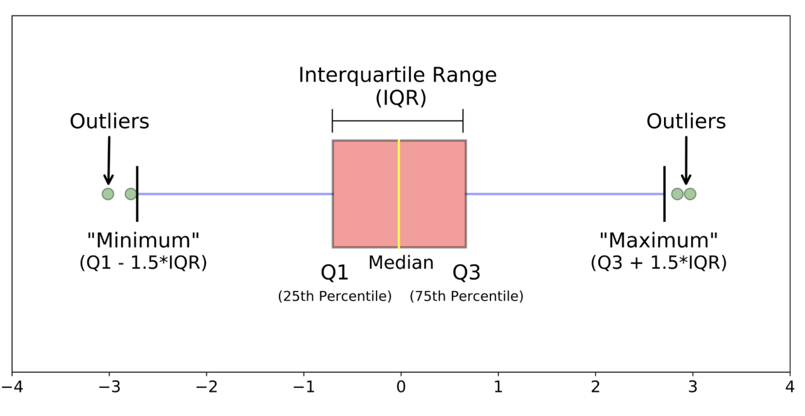

## Customer Segmentation Research 
by Firuz Juraev 

#### Figure 1: Framework of the paper


#### Related papers: 

### Checking for outliers 
1. Turkey outlier detector 

  

```python
def turkey_outlier_detector(df, cols=None):
    if cols  is None:
        cols = [str(s) for s in df.describe().columns]
        
    q1 = {}
    q3 = {}
    iqd = {}
    r_limit = {}
    l_limit = {}
    outlier_count = {}
    outlier_indices = {}
    for col in cols:
        q1[col] = np.percentile(df[col].values, 25)
        q3[col] = np.percentile(df[col].values, 75)
        iqd[col] = q3[col] - q1[col]
        r_limit[col] = q3[col] + 1.5*iqd[col]
        l_limit[col] = q1[col] - 1.5*iqd[col]
        data_outlier = df[~((df[col]<r_limit[col]).multiply(df[col]>l_limit[col]))]
        outlier_count[col] = data_outlier.shape[0]
        outlier_indices[col] = data_outlier.index
        
    for col in cols:
        print('_'*25)
        print(col+'-'*8+'>'+str(outlier_count[col]))
        
    return outlier_indices 
``` 

### Features Correlations 

It shows the correlation between features. 
```python 
fig,ax = plt.subplots(figsize=(8,4)) ## play with size 
fig.suptitle("Title here", fontsize=30)
corrcoef = df.corr()
mask = np.array(corrcoef)
mask[np.tril_indices_from(mask)] = False
sns.heatmap(corrcoef, mask=mask, vmax=.8, annot=True, ax=ax)
plt.show();
``` 
   

#### Dependant variables detection 

```python 
def dependant_variable_detector(df):
    from sklearn.preprocessing import StandardScaler
    from sklearn.linear_model import LinearRegression
    scaler = StandardScaler()
    lr = LinearRegression()
    columns = list(df.columns)
    for col in columns:
        y = scaler.fit_transform(df[col].values.reshape(-1,1))
        X = scaler.fit_transform(df.drop(col, axis=1).values)
        lr.fit(X,y)
        print('Using '+col+' as dependent variable R2 score is :'+str(lr.score(X,y)))  
``` 
dependant_variable_detector(clientsDF) 

```
Using Recency as dependent variable R2 score is :0.14698126654287424
Using Frequency as dependent variable R2 score is :0.8656755788525865
Using Monetary as dependent variable R2 score is :0.862874153878725
Using Language as dependent variable R2 score is :0.007583512995698594
```

##### Output 

### Plotting data with PCA 

##### Code 
```python 
from sklearn.decomposition import PCA 
import matplotlib.pyplot as plt

def pca_2d_plot(pca, df):
    fig, ax = plt.subplots(figsize=(10,10))
    transformed_data = pca.transform(df.values)
    ax.scatter(transformed_data[:,0], transformed_data[:,1], s=3)
    plt.show()
 
pca = PCA(n_components=3) ## 3 number of features 
pca.fit(df.values) 
pca_2d_plot(pca, df) 
```

### Hopkins Statistic

```python 
def hopkins_statistic(df):
    from sklearn.neighbors import NearestNeighbors
    from sklearn.preprocessing import StandardScaler
    n_samples = df.shape[0]
    num_samples = [int(f*n_samples) for f in [0.25,0.5,0.75]]
    states = [123,42,67,248,654]
    for n in num_samples:
        print('-'*12+str(n)+'-'*12)
        hopkins_statistic = []
        for random_state in states:
            data = df.sample(n=n, random_state=random_state)
            nbrs = NearestNeighbors(n_neighbors=2)
            scaler = StandardScaler()
            X = scaler.fit_transform(data.values)
            nbrs.fit(X)
            sample_dist = nbrs.kneighbors(X)[0][:,1]
            sample_dist = np.sum(sample_dist)
            random_data = np.random.rand(X.shape[0], X.shape[1])
            nbrs.fit(random_data)
            random_dist = nbrs.kneighbors(random_data)[0][:,1]
            random_dist = np.sum(random_dist)
            hs = sample_dist/(sample_dist+random_dist)
            hopkins_statistic.append(hs)
            print('*'*25)
            print('hopkins statistic :'+str(hs))
        print('mean hopkins statistic :'+str(np.mean(np.array(hopkins_statistic))))
        print('hopkins statistic standard deviation :'+str(np.std(np.array(hopkins_statistic))))
```

   

* H=0.5 -> distances are similar 
* H=0.0 -> actual data are highly clustered 
* H=1.0 -> actual data are regularly distributed in the data space (e.g grid)   

## Clustering Techniques 
1. Fuzzy C-Means Clustering 
```
pip install fuzzy-c-means
```
[Installation](https://pypi.org/project/fuzzy-c-means/)

```python 
import numpy as np
from fcmeans import FCM
from matplotlib import pyplot as plt

## fitting the fuzzy-c-means 

fcm = FCM(n_clusters=2)
fcm.fit(X)

# outputs
fcm_centers = fcm.centers
fcm_labels = fcm.predict(X)

# plot result = showing results 
f, axes = plt.subplots(1, 2, figsize=(11,5))
axes[0].scatter(X[:,0], X[:,1], alpha=.1)
axes[1].scatter(X[:,0], X[:,1], c=fcm_labels, alpha=.1)
axes[1].scatter(fcm_centers[:,0], fcm_centers[:,1], marker="+", s=500, c='w')
plt.savefig('images/basic-clustering-output.jpg')
plt.show()
```
* Related Links: 
https://pythonhosted.org/scikit-fuzzy/auto_examples/plot_cmeans.html 

2. Hierarchical Clustering 

```python 
from sklearn.cluster import AgglomerativeClustering 

clustering_model = AgglomerativeClustering(n_clusters=n)  
clusters = clustering_model.fit_predict(X) 

``` 

+ Plot Hierarchical Clustering Dendrogram 

```python
def plot_dendrogram(model, **kwargs):
    # Create linkage matrix and then plot the dendrogram

    # create the counts of samples under each node
    counts = np.zeros(model.children_.shape[0])
    n_samples = len(model.labels_)
    for i, merge in enumerate(model.children_):
        current_count = 0
        for child_idx in merge:
            if child_idx < n_samples:
                current_count += 1  # leaf node
            else:
                current_count += counts[child_idx - n_samples]
        counts[i] = current_count

    linkage_matrix = np.column_stack(
        [model.children_, model.distances_, counts]
    ).astype(float)

    # Plot the corresponding dendrogram
    dendrogram(linkage_matrix, **kwargs)
```

```python 
from sklearn.cluster import AgglomerativeClustering 
from scipy.cluster.hierarchy import dendrogram 
clustering_model = AgglomerativeClustering(distance_threshold=0, n_clusters=None)  ### if we want to create dendrogram, we cannot define number of clusters 
clusters = clustering_model.fit_predict(X)  


plt.title("Hierarchical Clustering Dendrogram")
# plot the top five levels of the dendrogram
plot_dendrogram(clustering_model, truncate_mode="level", p=5) ## calling the above funtion
plt.xlabel("Number of points in node (or index of point if no parenthesis).")
plt.show()

```
   

### Metrics 

```python 
from sklearn.metrics import silhouette_score
from sklearn.metrics import davies_bouldin_score  

silhouette_score(X, labels)
davies_bouldin_score(X, labels) 

```
#### Silhouette Coefficient
Silhouette Coefficient or silhouette score is a metric used to calculate the goodness of a clustering technique. Its value ranges from -1 to 1.

* 1: Means clusters are well apart from each other and clearly distinguished.
* 0: Means clusters are indifferent, or we can say that the distance between clusters is not significant.
* -1: Means clusters are assigned in the wrong way.

 

Some sources: 

* https://towardsdatascience.com/silhouette-coefficient-validating-clustering-techniques-e976bb81d10c 


#### Davies-Bouldin score

The score is defined as the average similarity measure of each cluster with its most similar cluster, where similarity is the ratio of within-cluster distances to between-cluster distances. Thus, clusters which are farther apart and less dispersed will result in a better score.

