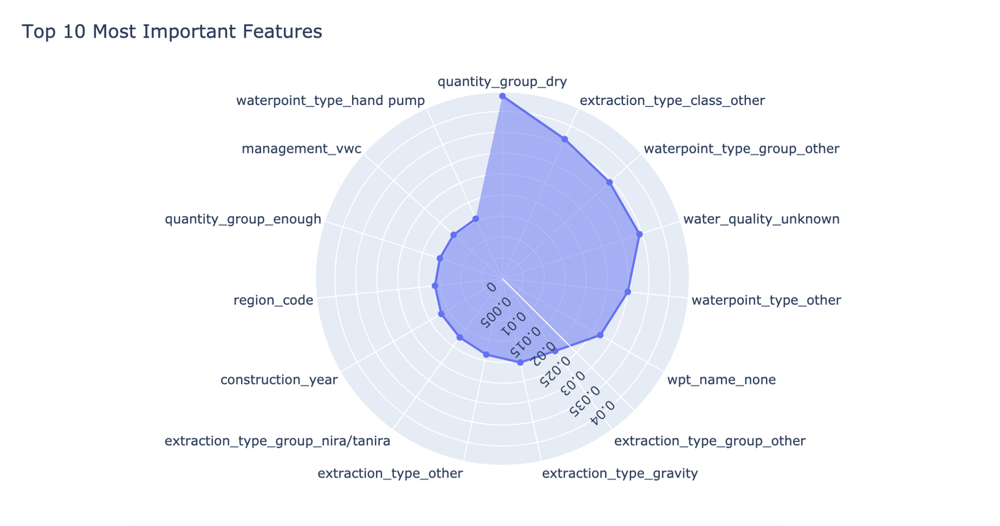

## Classification Task 

by Firuz Juraev 


### Feature Importance 

```python 
import plotly.graph_objects as go  

feat_importance_xgb = pd.Series(model_xgboost.feature_importances_, index = X_train.columns) 
feat_importance_xgb.sort_values(ascending=False, inplace=True) 

feat_importance_xgb_top_8 = feat_importance_xgb[:10] ### taking top 10 important features 

fig = go.Figure(data=go.Scatterpolar(r=feat_importance_xgb_top_8.values, theta=feat_importance_xgb_top_8.index)) 
fig.update_traces(fill='toself')  

```

 
